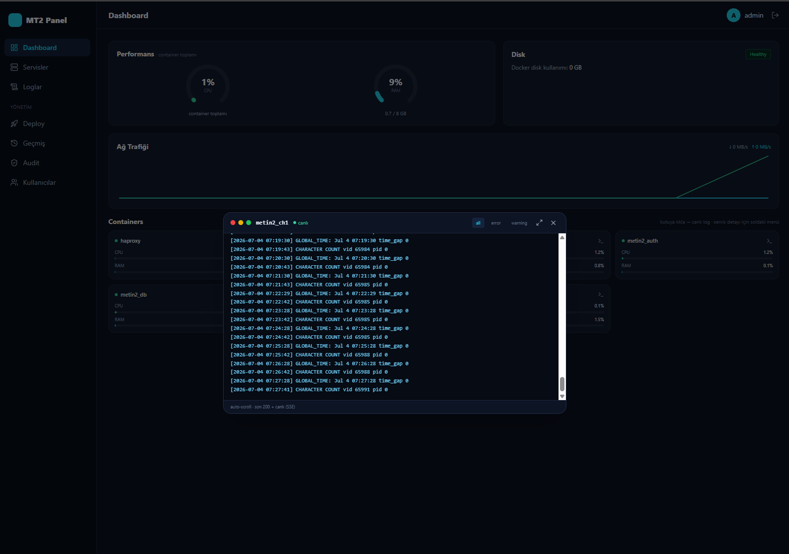
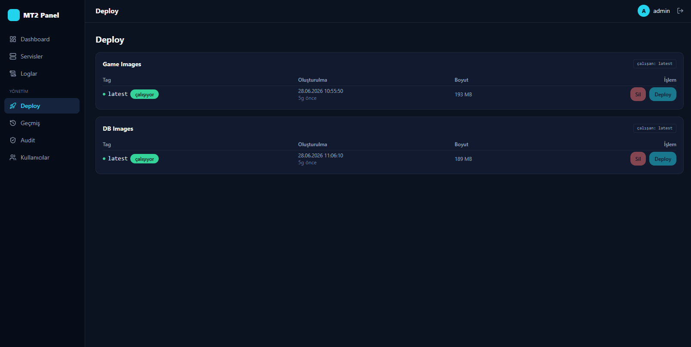
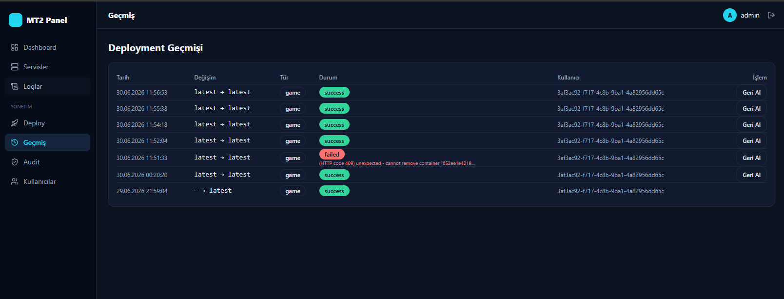
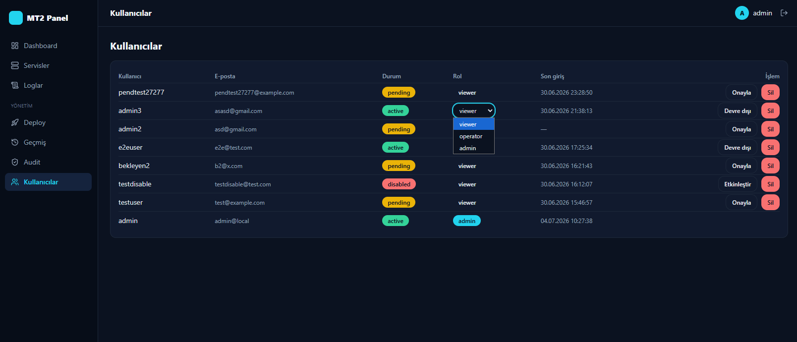
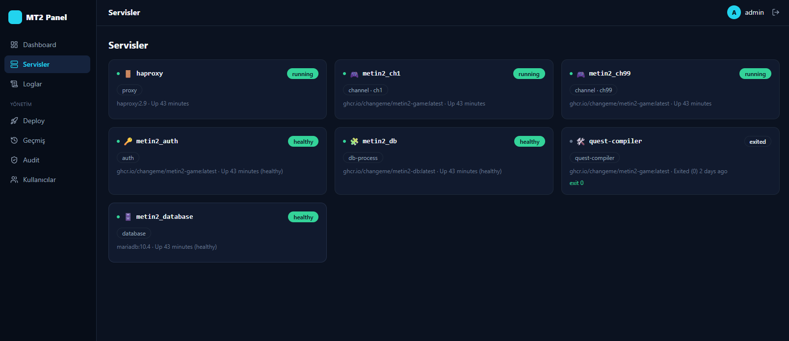
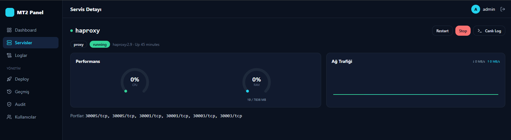

# MT2 Panel — Metin2 Docker Yönetim Paneli

Docker ile çalışan bir Metin2 sunucusunu (auth / db / channel / database / haproxy / quest-compiler) izlemek ve yönetmek için web tabanlı yönetim paneli.

> **Önemli kapsam notu:** Panel **image oluşturmaz**. Yalnızca önceden oluşturulmuş Docker image'larını ayağa kaldırır ve container'ları yönetir (izleme, health, stats, start/stop/restart). Image build etmek panelin görevi değildir.

Bu depo şu an **Faz 0 + Faz 1**'i içerir: kimlik doğrulama (panel kullanıcıları) + read-only izleme + temel container işlemleri (restart/stop). Log streaming, deploy/rollback ve audit sonraki fazlardır (bkz. [Yol Haritası](#yol-haritası)).

---

## İçindekiler
1. [Özellikler](#özellikler)
2. [Mimari](#mimari)
3. [Teknoloji](#teknoloji)
4. [Önkoşullar](#önkoşullar)
5. [Kurulum (ilk kez)](#kurulum-ilk-kez)
6. [Geliştirme — çalıştırma](#geliştirme--çalıştırma)
7. [Ortam değişkenleri (.env)](#ortam-değişkenleri-env)
8. [Komut referansı](#komut-referansı)
9. [Servis keşfi nasıl çalışır](#servis-keşfi-nasıl-çalışır)
10. [API uçları](#api-uçları)
11. [Test](#test)
12. [Proje yapısı](#proje-yapısı)
13. [Sorun giderme](#sorun-giderme)
14. [Production'a doğru](#productiona-doğru)
15. [Yol haritası](#yol-haritası)

---

## Özellikler

- 🔐 **Auth:** Panel kullanıcıları PostgreSQL'de (oyundan bağımsız), şifreler **bcrypt**. JWT access (15dk) + refresh (7gün, Redis). Logout → token blacklist. Roller: `admin`, `operator`, `viewer`.
- 👤 **Üyelik + onay:** Public kayıt (`/register`, kullanıcı adı+e-posta+şifre) → kullanıcı **pending** (giriş yapar ama hiçbir şey yapamaz, "onay bekleniyor" ekranı). Admin `/users`'tan **onaylar + rol verir** → erişim açılır. `disabled` giriş yapamaz; disable **anında** etkili (JWT canlı DB kontrolü). Admin kendini veya **son aktif admin'i** kilitleyemez. Tüm kullanıcı-yönetimi + kayıt eylemleri audit'lenir.
- 📊 **Dinamik servis keşfi:** Çalışan MT2 container'ları Docker API'den otomatik keşfedilir (sabit liste yok). Yeni `metin2_ch*` eklenince panel yeniden başlatılmadan görünür.
- ❤️ **Health & stats:** Healthcheck zinciri (database→db→auth→channel→haproxy), CPU/RAM/network grafiği, quest-compiler exit-code uyarısı.
- 🔁 **Container işlemleri:** Graceful restart/stop (`--time=30`), onay modalı ile, sadece admin/operator.
- 📜 **Canlı log izleme (SSE):** Servis seç → son 200 satır + canlı akış; Metin2 log formatı parse + level renklendirme (error→kırmızı, warning→sarı) + level filtresi; quest-compiler için tam çıktı (REST tail). Token header'da (fetch-event-source), URL'de değil.
- 🚀 **Deploy / Rollback (socket):** Mevcut image tag'lerini listele → seçilen tag'e geç. Tüm game-binary servisler (auth/db/ch*/quest-compiler) **Docker API üzerinden recreate** edilir (network/port/volume korunur; mariadb/haproxy dokunulmaz); canlı SSE terminali; healthcheck-wait; hata'da otomatik eski tag'e dönüş; geçmiş + "bu tag'e dön" rollback. **Sadece admin.** Dosya/compose-CLI bağımlılığı yok → panel ile MT2 ayrı sunucularda olabilir (`DOCKER_HOST=tcp://...`).
- 📋 **Merkezi audit log:** Tüm hassas eylemler (login, **başarısız login**, logout, restart/stop, deploy) kim-ne-ne zaman-sonuç-IP olarak kaydedilir; admin'e `/audit`'te filtrelenebilir (eylem/kullanıcı) tablo. Audit kaydı başarısız olsa bile ana eylem etkilenmez. **Sadece admin.**
- 🛡️ **İzole Docker erişimi:** Panel doğrudan Docker socket'e bağlanmaz; tüm trafik `docker-socket-proxy` üzerinden geçer (`EXEC=0`, `BUILD=0`).

---

## Mimari

```
Tarayıcı ──HTTP──> React (Vite, :5173)
                      │  /api, /ws proxy
                      ▼
                 NestJS API (:3001)  ── JWT auth · RolesGuard
                      │
        ┌─────────────┼───────────────┐
        ▼             ▼               ▼
   PostgreSQL     Redis        docker-socket-proxy (:2375)
   (panel_users) (token/      (read-only + POST; EXEC/BUILD kapalı)
                  refresh)            │
                                      ▼
                              Docker Engine
                              (metin2-svfiles container'ları)
```

Panel, mevcut MT2 `docker-compose` kurulumuna **dokunmaz**; container'ları isim/label üzerinden Docker API ile okur ve yönetir.

---

## Teknoloji

**Backend:** NestJS 10 · TypeORM 0.3 + PostgreSQL 16 · Redis 7 (ioredis) · Dockerode 4 · @nestjs/jwt + passport-jwt · bcrypt · Jest
**Frontend:** React 19 · Vite 6 · Tailwind v4 · TanStack Query 5 · Zustand · React Router 6 · Recharts · axios · Vitest + Testing Library
**Altyapı:** Docker Compose · tecnativa/docker-socket-proxy

> Not: Plan Tailwind 3 / Vite 5 / React 18 öngörüyordu; yerel Node sürümü nedeniyle Vite 6 / React 19 / Tailwind v4'e güncellendi (işlevsel olarak eşdeğer).

---

## Önkoşullar

- **Node.js 20+** (LTS önerilir)
- **Docker Desktop** (Windows) veya **Docker Engine** (Linux) — çalışır durumda
- Yönetilecek **MT2 sunucusu** Docker'da çalışıyor olmalı (compose projesi varsayılan: `metin2-svfiles`)
- `openssl` (JWT secret üretmek için; opsiyonel)

---

## Kurulum (ilk kez)

```bash
# 1. Bağımlılıkları kur (monorepo — kök dizinde)
npm install

# 2. .env dosyasını oluştur
cp .env.example .env

# 3. JWT secret üret ve .env içine yapıştır (JWT_SECRET)
openssl rand -hex 64

# 4. .env içindeki REPLACE_* değerlerini doldur:
#    JWT_SECRET, PANEL_ADMIN_PASS, POSTGRES_PASSWORD, (varsa REDIS_PASSWORD)
#    ve MT2_PROJECT'ı kendi compose proje adınla eşle (varsayılan: metin2-svfiles)

# 5. Altyapıyı ayağa kaldır (postgres + redis + socket-proxy)
npm run infra:up

# 6. Veritabanı şemasını oluştur (migration)
npm run typeorm --workspace apps/backend -- migration:run

# 7. İlk admin kullanıcısını oluştur (.env'deki PANEL_ADMIN_USER/PASS)
npm run seed --workspace apps/backend
```

---

## Geliştirme — çalıştırma

Üç şey çalışır olmalı: **altyapı** (Docker'da), **backend**, **frontend**.

```bash
# Altyapı (bir kez; arka planda kalır)
npm run infra:up

# Terminal 1 — Backend (watch, :3001)
npm run dev:be

# Terminal 2 — Frontend (Vite, :5173)
npm run dev:fe
```

Ardından tarayıcıda **http://localhost:5173** → `.env`'deki admin kullanıcı/şifre ile giriş yap.

İlk girişten sonra `/services` sayfasında çalışan MT2 container'larını, `/dashboard`'da healthcheck zincirini görürsün.

Durdurmak için:
```bash
npm run infra:down   # postgres/redis/socket-proxy'yi durdurur (veriler volume'da kalır)
```

---

## Ortam değişkenleri (.env)

Tek kök `.env` tüm servislerce okunur. `.env` **commit edilmez**; `.env.example` şablondur.

| Değişken | Açıklama | Örnek |
|---|---|---|
| `NODE_ENV` | Ortam | `development` |
| `BACKEND_PORT` | API portu | `3001` |
| `VITE_API_URL` | Frontend'in çağıracağı API | `http://localhost:3001` |
| `JWT_SECRET` | JWT imza anahtarı (`openssl rand -hex 64`) | `(64+ hex)` |
| `JWT_ACCESS_TTL` | Access token süresi (sn) | `900` |
| `JWT_REFRESH_TTL` | Refresh token süresi (sn) | `604800` |
| `PANEL_ADMIN_USER` | İlk admin kullanıcı adı (seed) | `admin` |
| `PANEL_ADMIN_PASS` | İlk admin şifresi (seed) | `(güçlü şifre)` |
| `POSTGRES_HOST/PORT/DB/USER/PASSWORD` | PostgreSQL bağlantısı | `localhost` / `5432` / `panel_db` / `panel` / … |
| `REDIS_HOST/PORT/PASSWORD` | Redis bağlantısı | `localhost` / `6379` / `(boş)` |
| `DOCKER_HOST` | socket-proxy adresi | `tcp://localhost:2375` |
| `MT2_PROJECT` | İzlenecek compose proje adı (keşif filtresi) | `metin2-svfiles` |
| `LOG_LEVEL` | Log seviyesi | `info` |

> `MT2_PROJECT`, gerçek MT2 container'larının `com.docker.compose.project` label'ı ile eşleşmelidir. Doğrulamak için: `docker inspect <container> --format '{{ index .Config.Labels "com.docker.compose.project" }}'`

---

## Komut referansı

**Kök dizin:**
| Komut | Ne yapar |
|---|---|
| `npm run infra:up` | postgres + redis + socket-proxy başlatır |
| `npm run infra:down` | altyapıyı durdurur |
| `npm run dev:be` | backend'i watch modda çalıştırır |
| `npm run dev:fe` | frontend dev sunucusunu çalıştırır |

**Backend (`--workspace apps/backend`):**
| Komut | Ne yapar |
|---|---|
| `npm run start:dev` | Nest watch |
| `npm run build` | Üretim derlemesi |
| `npm test` | Jest unit |
| `npm run test:e2e` | Jest e2e (infra + seed gerekli) |
| `npm run typeorm -- migration:run` | Migration uygular |
| `npm run typeorm -- migration:generate src/database/migrations/<Ad>` | Migration üretir |
| `npm run seed` | Admin kullanıcıyı seed eder (idempotent) |

**Frontend (`--workspace apps/frontend`):**
| Komut | Ne yapar |
|---|---|
| `npm run dev` | Vite dev (:5173) |
| `npm run build` | Üretim derlemesi |
| `npm test` | Vitest |

---

## Servis keşfi nasıl çalışır

Panel sabit servis listesi tutmaz. Her sorguda:

1. `docker.listContainers({all:true})` → `com.docker.compose.project === MT2_PROJECT` olanlar filtrelenir.
2. Görünen ad: `com.docker.compose.service` label'ından (`metin2_auth`, `metin2_ch1`, …).
3. Her container `inspect` edilir; `Config.Env`'den `MT2_ROLE` ve `CHANNEL` okunur.
4. Rol çözümü (`resolveRole`): isim `database`/`quest-compiler`/`haproxy` → ilgili rol; sonra `MT2_ROLE` `db`→db-process, `auth`→auth, `core`→channel; aksi halde channel.
5. Sonuçlar 5 sn cache'lenir (frontend de 5 sn poll eder).

Yeni bir kanal (`metin2_ch3` vb.) compose'a eklendiğinde panel kodu değişmeden listelenir.

---

## API uçları

Tümü (login hariç) `Authorization: Bearer <accessToken>` gerektirir.

```
POST /auth/login        { username, password } → { accessToken, refreshToken, user }
POST /auth/refresh      { refreshToken }        → { accessToken }
POST /auth/logout       (Bearer)                → 204
GET  /auth/me           (Bearer)                → { id, username, role }

GET  /services                      → tüm MT2 servisleri (dinamik)
GET  /services/:name                → tek servis kartı
GET  /services/:name/stats          → CPU/RAM/network
GET  /services/:name/healthcheck    → health durumu/log
POST /services/:name/restart        → graceful restart   (admin|operator)
POST /services/:name/stop           → graceful stop       (admin|operator)

GET  /logs/:name?tail=N             → son N satır (REST, parse edilmiş)
GET  /logs/:name/stream             → canlı log akışı (SSE, text/event-stream)

GET  /deploy/tags                   → mevcut tag'ler + çalışan tag        (admin)
POST /deploy                        → { tag } seçilen tag'e deploy        (admin)
GET  /deploy/jobs/:id/stream        → deploy ilerlemesi (SSE)             (admin)
GET  /deployments                   → deploy geçmişi                       (admin)

GET  /audit                         → audit log (action/username/tarih filtre) (admin)

POST /auth/register                 → public kayıt (pending kullanıcı)
GET  /users                         → kullanıcı listesi                   (admin)
PATCH/DELETE /users/:id             → onayla+rol / rol / disable / sil    (admin)

GET  /health                        → { status: 'ok' }
```

---

## Test

```bash
npm test --workspace apps/backend     # 23 unit testi
npm test --workspace apps/frontend    # 4 component/hook testi
npm run test:e2e --workspace apps/backend   # auth e2e (infra + seed gerekli)
```

---

## Proje yapısı

```
mt2-panel/
├── apps/
│   ├── backend/                 # NestJS API
│   │   └── src/
│   │       ├── config/          # .env okuma (loadConfig)
│   │       ├── database/        # PanelUser entity, migration, seed
│   │       ├── redis/           # ioredis provider
│   │       ├── auth/            # login/refresh/logout/me, JWT, guards, hash
│   │       ├── containers/      # docker provider, resolveRole, discovery, controller
│   │       └── common/          # log sanitize
│   └── frontend/                # React + Vite
│       └── src/
│           ├── lib/             # api client (axios), queryClient
│           ├── store/           # zustand auth (in-memory token)
│           ├── hooks/           # useServices, useServiceStats
│           ├── components/      # ServiceCard, HealthChain, ConfirmModal, ProtectedRoute
│           └── pages/           # Login, Dashboard, Services, ServiceDetail
├── infra/
│   └── docker-compose.dev.yml   # postgres + redis + socket-proxy
├── docs/plan/                   # mimari + spec + uygulama planı
├── .env.example
└── package.json                 # npm workspaces
```

---

## Sorun giderme

| Belirti | Çözüm |
|---|---|
| `/services` boş dönüyor | `MT2_PROJECT` değeri gerçek compose proje adıyla eşleşmiyor olabilir; `docker ps` ve label'ı kontrol et. socket-proxy ayakta mı? `curl http://localhost:2375/v1.41/containers/json` |
| Backend açılışta "Missing env" | `.env` dolu mu, kök dizinde mi? Backend kökteki `.env`'i okur. |
| Migration/connection hatası | `npm run infra:up` çalıştı mı? Postgres :5432 ayakta mı? `.env` POSTGRES_* doğru mu? |
| Login 401 | `npm run seed` çalıştırıldı mı? `.env`'deki PANEL_ADMIN_USER/PASS ile mi giriyorsun? |
| Frontend API'ye ulaşamıyor | Backend :3001 ayakta mı? CORS dev'de `http://localhost:5173`'e açık. |
| Port çakışması (2375/5432/6379) | Bu portları kullanan başka servis var mı? `infra/docker-compose.dev.yml`'de port eşlemesini değiştir. |

---

## Production'a doğru

Şu anki kurulum **geliştirme** içindir (Docker Desktop, TLS yok). Production (kiralık Ubuntu sunucu) için planlananlar:

- **Traefik v3** önünde TLS terminasyonu + rate limiting (compose taslağı `docs/plan/mt2-panel-mimari.md`'de hazır).
- Frontend + backend image'a build edilip compose ile deploy.
- socket-proxy aynı şekilde; `DOCKER_HOST=tcp://socket-proxy:2375`.
- CORS yalnızca panel domain'ine; panel portu public'e açılmaz; erişim VPN/Cloudflare Access arkasında.

---

## Yol haritası

- ✅ **Faz 0** — Auth & altyapı (JWT, Postgres, Redis, socket-proxy)
- ✅ **Faz 1** — Read-only izleme + restart/stop
- ✅ **Faz 2** — Canlı log izleme (SSE) + level filtre/renk + quest-compiler tail
- ✅ **Faz 3** — Deploy/rollback (socket recreate, mevcut image tag'lerine) + canlı SSE + geçmiş *(image **build** kapsam dışı)*
- ✅ **Faz 4** — Merkezi audit log (login/başarısız-login/restart/stop/deploy, filtreli, admin)
- ✅ **Faz 5** — Üyelik + onay kapısı + admin kullanıcı yönetimi (pending/active/disabled, lockout-önleme, audit) (bu sürüm)
- ⏳ **Son faz (görsel)** — Kurumsal UI/UX cila (dashboard, modal'lar, tema) + topoloji haritası; opsiyonel: FATAL log alarmı, haftalık rapor
- ⏳ 2FA (TOTP) — şema hazır, opsiyonel aktivasyon

---

## Ekran Görüntüleri












